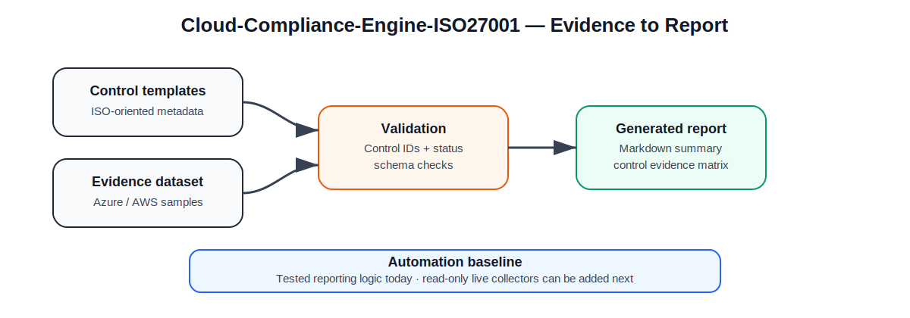

# Cloud-Compliance-Engine-ISO27001

[](https://github.com/Popoo2020/Cloud-Compliance-Engine-ISO27001/actions/workflows/ci.yml)
[](https://github.com/Popoo2020/Cloud-Compliance-Engine-ISO27001/actions/workflows/analysis.yml)
[](LICENSE)

**Cloud-Compliance-Engine-ISO27001** is a small, auditable automation project for turning structured cloud-security evidence into an ISO 27001-oriented compliance summary.  
It currently includes control templates, a sample multi-cloud evidence dataset, JSON schema validation, evidence freshness checks, a Markdown report generator, and automated tests that validate the reporting workflow.

> **Status:** working automation baseline / active expansion.



## Portfolio Assets

- [Demo screenshot](screenshots/cloud-compliance-report-demo.svg)
- [Case study export source](case-studies/cloud-compliance-case-study.md)
- [Generated sample report](samples/generated_report.md)

## What is implemented

| Capability | Status |
|---|---|
| ISO 27001 control template dataset | ✅ Implemented |
| Sample Azure/AWS evidence dataset | ✅ Implemented |
| JSON evidence validation | ✅ Implemented |
| Evidence freshness checks | ✅ Implemented |
| Markdown report generation | ✅ Implemented |
| Automated pytest coverage | ✅ Implemented |
| CI validation + sample report generation | ✅ Implemented |
| Dedicated analysis workflow with explicit permissions | ✅ Implemented |
| Live Azure collector | 🟡 Planned |
| Live AWS collector | 🟡 Planned |
| Exception lifecycle tracking | 🟡 Planned |

## Repository structure

```text
src/
  report_generator.py        # Loads controls/evidence and builds a Markdown report

schemas/
  evidence.schema.json       # JSON schema for evidence records

templates/
  controls.json              # Initial ISO 27001-oriented control metadata

samples/
  sample_evidence.json       # Example multi-cloud evidence observations
  generated_report.md        # Generated by the reporting workflow / CI

tests/
  test_report_generator.py   # Validates report contents, schema checks and freshness logic

screenshots/
  cloud-compliance-report-demo.svg

case-studies/
  cloud-compliance-case-study.md
```

## Current workflow

```text
Structured control metadata
        │
        ▼
Structured evidence observations
        │
        ▼
JSON schema validation
        │
        ▼
Freshness assessment
        │
        ▼
Validation + aggregation logic
        │
        ▼
Markdown compliance summary
```

## Quickstart

```bash
git clone https://github.com/Popoo2020/Cloud-Compliance-Engine-ISO27001.git
cd Cloud-Compliance-Engine-ISO27001

python -m venv .venv
source .venv/bin/activate

pip install -r requirements.txt
pytest -q
python -m src.report_generator
```

The command above generates:

```text
samples/generated_report.md
```

## Example output categories

The generated report aggregates status counts for:

- `implemented`
- `partial`
- `missing`
- `not_applicable`

It also reports evidence freshness as:

- `fresh`
- `stale`

The control evidence matrix includes:

- control ID
- title
- provider
- current status
- evidence reference
- evidence date
- freshness state
- notes

## Why this project matters

This repository demonstrates the first practical layer of compliance engineering:

- normalising evidence into a structured schema
- validating control IDs and status values
- tracking evidence age and freshness windows
- creating a report suitable for expansion into audit workflows
- keeping the logic small enough to review and test

## Portfolio value

The project is particularly relevant for roles that connect:

- cloud security architecture
- compliance automation
- security governance engineering
- evidence collection and auditability

It shows the beginning of a credible **security-control automation** direction rather than a purely theoretical ISO 27001 note collection.

## Roadmap

1. Add read-only Azure evidence collectors
2. Add read-only AWS evidence collectors
3. Introduce richer control schemas and ownership metadata
4. Add policy exception tracking with expiry fields
5. Generate CSV/JSON outputs in addition to Markdown
6. Add signed evidence-pack export

## Release readiness

A sensible first tagged release would be **`v0.1.0`** once:

- CI is confirmed passing on `main`
- generated sample reports remain stable
- README scope remains clear that current inputs are sample evidence, not live cloud inventory

## Limitations

- This is not a complete ISO 27001 certification tool
- The current evidence is sample data, not a live cloud inventory
- The project intentionally separates **report-generation logic** from future **cloud collectors**
- Control coverage is deliberately small in this baseline version
