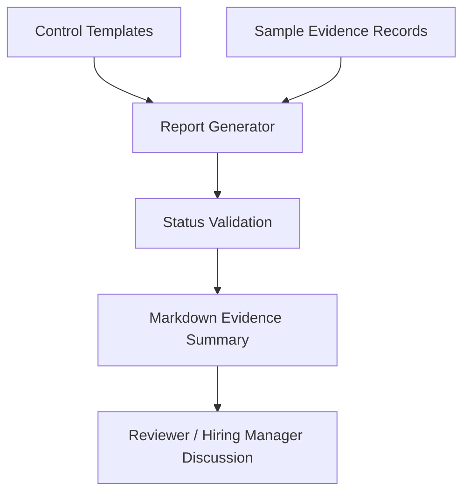

# Architecture

## Purpose

Cloud-Compliance-Engine-ISO27001 demonstrates a lightweight evidence-to-report workflow for ISO 27001-oriented readiness conversations.

The project takes structured control definitions and sample evidence records, validates them through Python logic and generates a Markdown report.

## High-level flow

## Components

| Component | Purpose |
|---|---|
| `templates/controls.json` | Defines representative ISO 27001-oriented controls. |
| `samples/sample_evidence.json` | Provides sample evidence statuses and notes. |
| `src/report_generator.py` | Loads controls and evidence, validates status and builds the report. |
| `samples/generated_report.md` | Demonstrates the generated output. |
| `tests/` | Validates import and report-generation behaviour. |

## Design principles

1. Evidence should be structured and repeatable.
2. Control status should be validated before report generation.
3. Reports should be clear enough for governance and audit-readiness conversations.
4. The project should not claim certification or formal audit status.
5. CI should validate tests, static review, dependency review and report generation.

## Operational boundary

This is a portfolio baseline for compliance automation. A real deployment would need stronger evidence storage, access control, retention rules, reviewer sign-off, exception tracking and organisation-specific control mapping.
