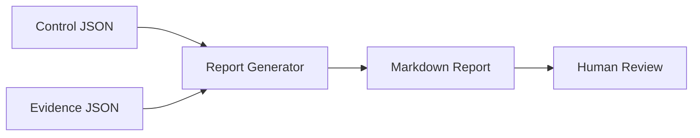

# Threat Model

## Scope

This threat model covers the portfolio version of Cloud-Compliance-Engine-ISO27001.

The project handles sample controls, sample evidence and generated Markdown reports. It is designed for learning, portfolio review and cybersecurity GRC discussions.

## Assets

| Asset | Why it matters |
|---|---|
| Control definitions | Define the expected governance areas. |
| Evidence records | Represent implementation status and reviewer notes. |
| Generated report | Summarises readiness and gaps. |
| CI workflow | Validates repeatable operation. |

## Trust boundaries

## Key risks and controls

| Risk | Impact | Existing control | Further hardening |
|---|---|---|---|
| Invalid evidence status | Misleading report | Status validation in code | Add JSON schema validation |
| Unsupported compliance claims | Misleading presentation | README limitations and recruiter summary | Add reviewer checklist |
| Sensitive evidence in samples | Confidentiality issue | Sample data only | Add sanitisation guidance |
| Report generation failure | Poor reliability | CI report generation | Add Makefile validation target |
| Dependency issue | Build or security concern | pip-audit in CI | Add pinned lockfile later |

## Security assumptions

- Sample evidence is fictional.
- No real client data should be committed.
- No private credentials are required.
- Generated reports require human review before use.

## Recommended future controls

1. Add schema validation for evidence and controls.
2. Add evidence freshness and review dates.
3. Add owner sign-off and exception expiry fields.
4. Add PDF/HTML output for management review.
5. Add richer Annex A mapping examples.
